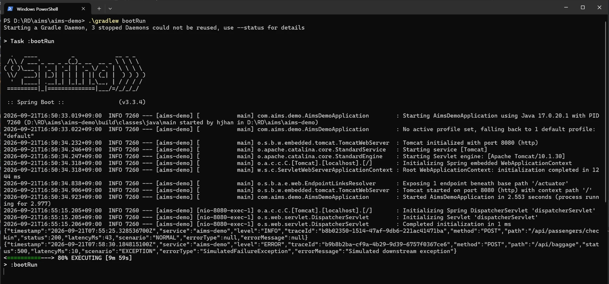
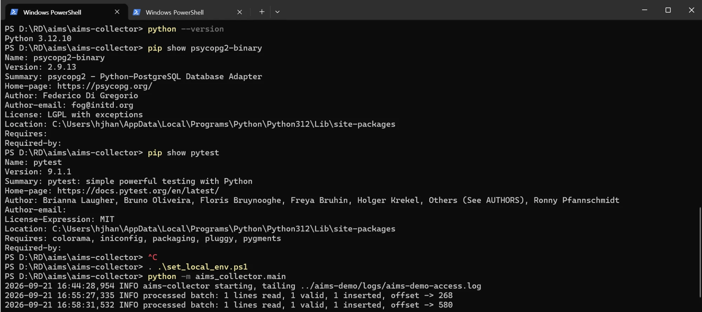
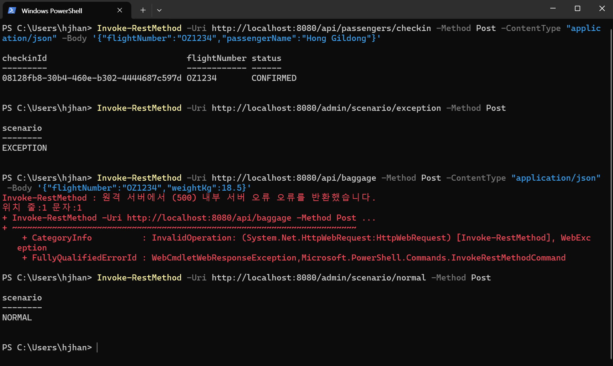
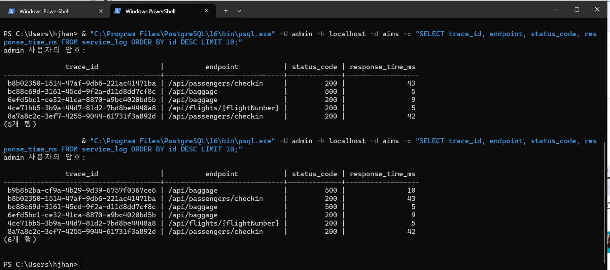

# AIMS (AI Incident Monitoring System)

## 1. 프로젝트 소개

AIMS는 운영 서비스의 로그와 성능 데이터를 기반으로 장애를 탐지하고, 발생한 Incident의 패턴과 근거를 분석하는 운영 자동화 시스템입니다.

이 프로젝트의 핵심 원칙은 "Rule이 판단할 수 있는 것은 Rule이 판단하고, Rule로 판단하기 어려운 비정형 정보는 향후 AI가 분석한다"입니다. 장애 발생 여부(Detection)는 명확한 Rule이 판단하고, 그렇게 발생한 Incident를 "어떤 패턴이고 무엇을 확인해야 하는가"로 해석(Analysis)하는 것도 **현재는 Rule 기반**으로 처리합니다. 현재 확보된 데이터(Rule 신호 3종, 예외 유형 1종)만으로 판단 가능한 범위까지만 구현했고, LLM은 아직 연결하지 않았습니다 — 원본 로그 전체를 무분별하게 분석 엔진에 넘기지 않고 집계·구조화한 정보만 사용하는 원칙은 AI를 붙일 때도 그대로 이어집니다.

```text
Phase 1~4  수집 → Metric → Rule → Incident
Phase 5    Incident → Rule-based Analysis
Future     Incident Context → AI/LLM Analysis
```

핵심 데이터 흐름:

```text
감시 대상 운영 서비스
        ↓
Structured JSON Log
        ↓
Log Collector
        ↓
PostgreSQL
        ↓
Metric Aggregation
        ↓
Rule Detection
        ↓
Incident (window_start/end, severity)
        ↓
Incident Analysis (Pattern / Evidence / Recommended Checks) — 현재 Rule 기반, 향후 AI 확장 지점
        ↓
Alert
```

이 흐름 전체를 실제로 동작하는 백엔드 시스템으로 구현하는 것이 이 프로젝트의 목표이며, 현재는 **Log Collector부터 Incident Analysis까지 실제로 동작**하는 상태이고, **Alert(및 그 이후의 AWS/Docker 배포)는 아직 구현 전**입니다.

---

## 2. 현재 진행 상태

아래는 [Phase Roadmap](#6-phase-roadmap) 기준 진행 상황입니다.

**Phase 1 — 프로젝트/DB 기반 구성 (완료)**

- monorepo 구조 (`aims-demo` / `aims-core` / `aims-collector` / `infra`)
- 세 서비스 모두 부팅 가능한 최소 골격 구성
- Flyway `V1__init_schema.sql` 작성 (5개 테이블 정의)
- Java 17 / Spring Boot 3.3.4, PostgreSQL Docker Compose 정의

**Phase 2 — aims-demo + structured log (완료)**

- Check-in / Flight / Baggage API 3종
- `NORMAL` / `SLOW_DB` / `EXCEPTION` 장애 시나리오 + Admin API
- 요청마다 NDJSON 구조화 로그 생성 (route template, latency, trace ID, 예외 정보 포함)

**Phase 3 — aims-collector (완료)**

- 로그 파일 tail → parse → validate → normalize → PostgreSQL batch insert
- `trace_id` UNIQUE 제약(Flyway `V2`) + `ON CONFLICT DO NOTHING`으로 재시도 시 중복 방지
- DB insert 실패 시 offset 미전진(재시도), 잘못된 로그는 dead letter로 분리

**Phase 4-1 — Metric Aggregation (완료)**

- `service_log`를 1분 윈도우로 집계해 `metric_snapshot` 생성 (스케줄러 기반, 실제 PostgreSQL로 검증 완료)

**Phase 4-2 — Rule Detection + Incident 생성 (완료)**

- Error Rate / P95 Latency / Exception Count 3개 Rule (Strategy 패턴, 확장 가능)
- 임계치 위반 시 `incident` 생성(중복 방지: 같은 service+endpoint에 열린 Incident 있으면 `incident_signal`만 추가)

**Phase 5 — Incident Analysis Engine, Rule 기반 (완료)**

- Incident 발생 패턴 분류(`LATENCY_DEGRADATION` / `ERROR_BURST` / `COMPOUND_DEGRADATION` / `UNKNOWN`)
- Metric + Signal + 대표 Exception 샘플을 근거(Evidence)로 구성, 패턴별 Recommended Checks 제공
- 신규 Incident 생성 시 최초 1회만 분석(재분석 안 함), `incident_analysis`에 저장
- **LLM/AI API는 아직 연결하지 않음** — 현재 데이터로 근거 있게 판단 가능한 범위까지만 Rule로 구현

**Phase 6 이후 — Alert, Docker, AWS, (필요성이 증명되면) AI 확장 — 미구현**

---

## 3. 서비스 책임

```text
aims-demo
= AIMS가 감시하는 가상의 운영 서비스 (AIMS 자체가 아님)

aims-collector
= structured log를 수집하여 service_log 테이블에 적재하는 역할

aims-core
= metric aggregation / detection / incident / AI / alert를 담당하는 AIMS 본체
```

- `aims-demo`: 위 책임(로그 생성)이 실제로 동작합니다.
- `aims-collector`: 위 책임(수집·적재)이 실제로 동작합니다.
- `aims-core`: 위 책임 중 **metric aggregation / detection / incident (생성 및 해석)까지** 실제로 동작합니다. "AI"라고 적힌 부분은 현재 Rule 기반으로 대체 구현되어 있고(Incident Analysis Engine), 실제 LLM 연동과 alert는 아직 구현 전입니다.

서비스 간 데이터 흐름은 `로그 생성 → 수집 → 적재 → 집계 → 탐지 → Incident 생성 → Incident 해석(Analysis)`까지 실제로 연결되어 있고, `Alert` 이후는 아직 연결되어 있지 않습니다.

---

## 4. 현재 아키텍처

**현재:**

```text
aims-demo
    ↓ (실제 연결)
aims-collector
    ↓ (실제 연결)
PostgreSQL
    ↓ (실제 연결)
aims-core
    ├── Metric Aggregation                              ← 실제 동작
    ├── Rule Detection (Error Rate/P95 Latency/Exception Count) ← 실제 동작
    ├── Incident (중복 방지, window_start/end 보존)        ← 실제 동작
    ├── Incident Analysis (Pattern/Evidence/Recommended Checks, Rule 기반) ← 실제 동작
    └── Alert                                             ← 미구현
```

`aims-demo → aims-collector → PostgreSQL → aims-core(Metric Aggregation → Rule Detection → Incident → Incident Analysis)`까지 실제 데이터가 흐르는 상태이고, `Alert`만 아직 연결되어 있지 않습니다.

**최종 목표:**

```text
aims-demo
    ↓
aims-collector
    ↓
PostgreSQL
    ↓
aims-core
    ├── Metric Aggregation
    ├── Rule Detection
    ├── Incident (window_start/end, severity)
    ├── Incident Analysis
    │     ├── Pattern (현재: Rule 기반 / 향후: 비정형·상관관계는 AI 확장 지점)
    │     ├── Evidence (Metric + Signal + Exception Sample)
    │     └── Recommended Checks
    └── Alert
```

Incident Analysis는 별도의 "AI Analysis" 단계가 아니라, **지금은 Rule로 채워져 있고 향후 필요성이 증명되면 그 안에서 AI로 확장**하는 구조입니다(원인을 구분할 수 있는 실제 데이터가 아직 하나뿐이라, AI를 붙이기 전에 `aims-demo`가 여러 실패 유형을 만들도록 확장하는 게 먼저 필요합니다).

---

## 5. DB Schema

`aims-core/src/main/resources/db/migration/`에 3개 마이그레이션이 있습니다.

- `V1__init_schema.sql` — 기본 5개 테이블 정의
- `V2__add_service_log_trace_id_unique.sql` — `service_log.trace_id` UNIQUE 제약 (collector 재시도 시 중복 방지, "1 request = 1 access log" 전제)
- `V3__add_incident_window_and_incident_analysis.sql` — `incident`에 `window_start`/`window_end` 추가, **`ai_analysis`를 삭제하고 `incident_analysis`로 대체**

| 테이블 | 설명 | 상태 |
|---|---|---|
| `service_log` | aims-demo가 남긴 구조화 로그가 저장되는 원본 테이블 | ✅ 실제로 적재 중 |
| `metric_snapshot` | service_log를 시간 윈도우 단위로 집계한 지표(요청 수, 에러 수, P95/P99 지연 등) | ✅ 실제로 생성 중 (매분 스케줄러) |
| `incident` | Rule Detection이 임계치 위반을 판단해 생성하는 장애 레코드. `window_start`/`window_end`로 어느 metric 윈도우에서 발생했는지 컨텍스트 보존 | ✅ 실제로 생성 중 (중복 방지 포함) |
| `incident_signal` | 어떤 Rule/값이 Incident를 트리거했는지 기록하는 상세 근거 | ✅ 실제로 생성 중 |
| `incident_analysis` | Incident 발생 패턴(Pattern)·근거(Evidence)·권장 조치(Recommended Checks). `analysis_type`/`analysis_version`으로 무엇이 만들었는지 기록(현재 값: `RULE`/`rule-v1`) | ✅ 실제로 생성 중 (Incident당 최초 1회) |

`ai_analysis`(LLM 호출을 전제로 한 `model`/`prompt_version` 컬럼)는 삭제했습니다 — 아직 LLM을 연결하지 않은 상태에서 그 이름/컬럼을 쓰는 게 맞지 않다고 판단했습니다. 실제로 AI를 연결하는 시점에 `incident_analysis.analysis_type`에 `RULE` 외의 값(예: `AI`)을 추가하는 방식으로 확장할 수 있습니다.

---

## 6. Phase Roadmap

```text
Phase 1   - 프로젝트/DB 기반 구성                 [완료]
Phase 2   - aims-demo + structured log            [완료]
Phase 3   - aims-collector (Data Collection)      [완료]
Phase 4-1 - Metric Aggregation                    [완료]
Phase 4-2 - Rule Detection + Incident 생성         [완료]
Phase 5   - Incident Analysis Engine (Rule 기반)  [완료]   ← [현재]
Phase 6+  - Alert / Docker / AWS / (필요성 증명 시) AI 확장
```

> 원래는 Phase 5를 "AI Incident Analysis"(LLM 연동)로 계획했으나, 설계 검토 과정에서 "Rule로 판단 가능한 것까지 LLM에 맡기는 건 불필요하다"는 결론에 이르러 방향을 바꿨습니다. 실제 데이터(예외 유형 1종, Rule 신호 3종)로 근거 있게 분류 가능한 범위까지만 Rule 기반 Incident Analysis Engine으로 구현했고, LLM 연동은 `aims-demo`가 여러 실패 유형을 만들도록 확장되는 등 실제로 AI가 필요해지는 시점에 재검토합니다.

---

## 7. 검증 상태

개발 환경(회사 원격 PC)에서는 Docker Desktop을 사용할 수 없어, PostgreSQL은 **로컬에 직접 설치**해서 검증했습니다. Docker Compose 자체(`infra/docker-compose.yml`)는 별도로 검증이 필요합니다.

**검증 완료 (로컬 PostgreSQL 기준)**

- `aims-demo`: `./gradlew build` 성공, 실제 기동 후 3개 API + NORMAL/SLOW_DB/EXCEPTION 시나리오 + structured log 생성 확인
- `aims-core`: 로컬 PostgreSQL에 연결해 Flyway `V1`~`V3` migration 실제 적용(`flyway_schema_history`로 확인), `service_log.trace_id` UNIQUE 제약 및 `incident.window_start`/`window_end`/`incident_analysis` 테이블 생성 확인, `/actuator/health`의 `db` 컴포넌트 `UP` 확인
- `aims-collector`: 실제 로그 파일을 tail하여 PostgreSQL `service_log`에 실제 INSERT 확인, DB 장애 시 offset 미전진(재시도) 확인, 동일 배치 재처리 시 중복 미삽입 확인
- **End-to-end (EXCEPTION 시나리오 포함)**: `aims-demo` → `aims-collector` → PostgreSQL 전체 파이프라인을 NORMAL 요청과 EXCEPTION 시나리오 모두에 대해 실제로 실행해 `service_log`에 `status_code=500`, `exception_type=SimulatedFailureException` 행까지 정상 적재되는 것을 확인 (실제 캡처: 8절 "실행 결과 예시" 참고)
- **Metric Aggregation (Phase 4-1)**: `aims-core` 스케줄러가 매분 실제로 동작해 `service_log`를 집계, 보낸 트래픽(checkin 1건 + flight 2건 + baggage 2건(1건 EXCEPTION))과 `metric_snapshot`의 `request_count`/`error_count`/`avg_latency_ms`가 정확히 일치하는 것을 확인. Collector 지연이 윈도우 마감보다 늦을 경우 해당 윈도우가 영구 누락되는 케이스(Backfill 미지원)도 실제로 재현 확인 — 별도 이슈로 기록, 우선순위 Low로 보류
- **Rule Detection + Incident (Phase 4-2)**: baggage 엔드포인트에 EXCEPTION 12회 발생 → `metric_snapshot`(request_count=12, error_count=12) 확인 → `incident`(severity=CRITICAL) + `incident_signal`(ERROR_RATE 100%>5%, EXCEPTION_COUNT 12>10) 생성 확인. 같은 엔드포인트에 재위반 발생 시 **새 Incident가 생기지 않고 기존 Incident에 signal만 누적**되는 것 확인(2개→4개)
- **Incident Analysis Engine (Phase 5)**: 위 Incident에 대해 `incident_analysis`가 정확히 1건 생성되고, `pattern`(ERROR_BURST) 판단 근거인 `evidence`에 실제 metric 수치·트리거된 signal·`service_log`의 대표 exception 샘플(`SimulatedFailureException` / `Simulated downstream exception`)이 그대로 포함되는 것을 확인. `incident.window_start`/`window_end`가 실제 metric 윈도우와 정확히 일치하는 것도 확인. 같은 Incident에 2차 위반이 추가돼도 **`incident_analysis`는 재생성되지 않고 1건으로 유지**되는 것 확인

**미검증**

- `infra/docker-compose.yml`을 통한 PostgreSQL 기동 (Docker Desktop 필요 — Mac 등 Docker 가능 환경에서 검증 예정)

---

## 8. 실행 방법

### aims-demo (검증 완료)

```bash
cd aims-demo
./gradlew build
./gradlew bootRun
curl http://localhost:8080/actuator/health
```

### PostgreSQL + aims-core (Docker 환경, Mac 등 — 검증 예정)

```bash
cd infra
cp .env.example .env
docker compose up -d postgres        # 검증 예정 (Docker 환경 필요)

cd ../aims-core
./gradlew bootRun                    # 검증 예정 (PostgreSQL 필요, 기동 시 Flyway 자동 적용)
curl http://localhost:8081/actuator/health   # 검증 예정 (db 컴포넌트 UP 확인)

docker exec -it aims-postgres psql -U aims -d aims -c '\dt'   # 검증 예정 (5개 테이블 확인)
```

### 로컬 Windows 환경에서 Docker 없이 전체 파이프라인 실행하기 (검증 완료)

회사 원격 PC처럼 Docker를 쓸 수 없는 환경에서는, PostgreSQL을 로컬에 직접 설치해서 동일하게 테스트할 수 있습니다.

**0) 사전 준비 (한 번만)**

- PostgreSQL을 로컬에 설치하고 로그인 계정을 만든 뒤, `aims` 데이터베이스를 생성합니다.
  ```sql
  CREATE DATABASE aims;
  ```
- **JDK 17**이 필요합니다 (Spring Boot 3.3.4는 빌드 자체에 JDK 17 이상을 요구). 회사 PC처럼 다른 프로젝트가 Java 8을 쓰고 있어 전역 `JAVA_HOME`을 바꿀 수 없다면, JDK 17만 별도로 설치한 뒤 `aims-demo/`와 `aims-core/`에 각각 `gradle.properties`를 만들어 그 프로젝트에서만 사용하도록 지정합니다(전역 설정을 건드리지 않음, `.gitignore`에 등록되어 있어 각자 로컬에 직접 만들어야 함).
  ```properties
  # aims-demo/gradle.properties, aims-core/gradle.properties (각각 생성)
  org.gradle.java.home=C:/Program Files/Eclipse Adoptium/jdk-17.x.x-hotspot
  ```
- Python(3.10+)이 필요합니다. 설치 후:
  ```bash
  cd aims-collector
  pip install -r requirements-dev.txt
  ```

**1) DB 접속 정보를 로컬 전용 파일로 등록** (모두 `.gitignore`에 등록되어 있어 저장소에는 없음 — 각자 로컬에 직접 생성)

```yaml
# aims-core/src/main/resources/application-local.yml
spring:
  datasource:
    username: <본인 DB 계정>
    password: <본인 DB 비밀번호>
```

```powershell
# aims-collector/set_local_env.ps1
$env:DB_HOST = "localhost"
$env:DB_PORT = "5432"
$env:DB_NAME = "aims"
$env:DB_USER = "<본인 DB 계정>"
$env:DB_PASSWORD = "<본인 DB 비밀번호>"
```

**2) aims-core 실행 → Flyway migration 적용 확인**

```powershell
cd aims-core
$env:SPRING_PROFILES_ACTIVE = "local"
.\gradlew bootRun
```
`db: UP`이 나오면 성공:
```powershell
curl http://localhost:8081/actuator/health
```

**3) aims-demo 실행 (계속 켜둠)**

```powershell
cd aims-demo
.\gradlew bootRun
```

**4) 요청을 보내 structured log 생성**

```powershell
Invoke-RestMethod -Uri http://localhost:8080/api/passengers/checkin -Method Post -ContentType "application/json" -Body '{"flightNumber":"OZ1234","passengerName":"Hong Gildong"}'
Invoke-RestMethod -Uri http://localhost:8080/api/flights/OZ1234
Invoke-RestMethod -Uri http://localhost:8080/api/baggage -Method Post -ContentType "application/json" -Body '{"flightNumber":"OZ1234","weightKg":18.5}'
```

**5) aims-collector 실행 (계속 켜둠) → 로그를 PostgreSQL로 적재**

```powershell
cd aims-collector
. .\set_local_env.ps1
python -m aims_collector.main
```
`processed batch: N lines read, N valid, N inserted, offset -> ...` 로그가 뜨면 정상입니다.

**6) DB에서 결과 확인**

```powershell
psql -U <본인 DB 계정> -h localhost -d aims -c "SELECT trace_id, endpoint, status_code, response_time_ms FROM service_log ORDER BY id DESC LIMIT 10;"
```

**장애 시나리오까지 확인하려면** (창3이 계속 켜진 상태에서):
```powershell
Invoke-RestMethod -Uri http://localhost:8080/admin/scenario/exception -Method Post
Invoke-RestMethod -Uri http://localhost:8080/api/baggage -Method Post -ContentType "application/json" -Body '{"flightNumber":"OZ1234","weightKg":18.5}'
Invoke-RestMethod -Uri http://localhost:8080/admin/scenario/normal -Method Post
```
`status_code=500`, `exception_type=SimulatedFailureException`인 행이 `service_log`에 그대로 들어오는 것을 확인할 수 있습니다.

**7) Metric Aggregation 확인** (aims-core가 계속 켜진 상태로 1분 정도 대기 후)

```powershell
psql -U <본인 DB 계정> -h localhost -d aims -c "SELECT service_name, endpoint, window_start, window_end, request_count, error_count, avg_latency_ms, p95_latency_ms, p99_latency_ms FROM metric_snapshot ORDER BY window_start DESC;"
```
매분 정각 스케줄러가 `service_log`를 집계해 `metric_snapshot`에 행을 넣습니다. `aims-core` 콘솔에도 `aggregated window [...]: N endpoint(s)` 로그가 매분 찍힙니다.

**8) Rule Detection + Incident + Incident Analysis 확인** (임계치를 넘길 만큼 EXCEPTION 요청을 여러 번 보낸 뒤, 다음 스케줄러 tick까지 대기)

```powershell
for ($i=0; $i -lt 12; $i++) {
  Invoke-RestMethod -Uri http://localhost:8080/api/baggage -Method Post -ContentType "application/json" -Body '{"flightNumber":"OZ1234","weightKg":18.5}'
}
```
(사전에 `/admin/scenario/exception`으로 전환해두어야 실제로 에러가 납니다.)

```powershell
psql -U <본인 DB 계정> -h localhost -d aims -c "SELECT id, service_name, endpoint, severity, status, window_start, window_end FROM incident ORDER BY id DESC LIMIT 5;"
psql -U <본인 DB 계정> -h localhost -d aims -c "SELECT incident_id, signal_type, signal_value, threshold FROM incident_signal ORDER BY id DESC LIMIT 10;"
psql -U <본인 DB 계정> -h localhost -d aims -c "SELECT incident_id, analysis_type, analysis_version, summary, evidence, recommended_checks FROM incident_analysis ORDER BY id DESC LIMIT 5;"
```
`incident`에 `severity=CRITICAL`(또는 `WARNING`)인 행, `incident_signal`에 트리거된 규칙, `incident_analysis`에 패턴별 summary/evidence/recommended_checks가 보이면 정상입니다. 같은 엔드포인트에 반복 위반을 보내도 `incident`/`incident_analysis`는 새로 늘지 않고 `incident_signal`만 누적되어야 합니다.

### 실행 결과 예시 (실제 캡처, EXCEPTION 시나리오 포함)

위 절차를 로컬 Windows 환경(Docker 없이, 로컬 PostgreSQL)에서 실제로 실행한 화면입니다. NORMAL 요청과 EXCEPTION 시나리오를 함께 재현했습니다.

**1) aims-demo — 구조화 로그 출력** (NORMAL 요청과 EXCEPTION 요청이 각각 INFO/ERROR로 기록됨)



**2) aims-collector — 로그를 tail하여 PostgreSQL에 적재**



**3) 요청 전송 — EXCEPTION 시나리오 전환 후 baggage 호출 시 실제 500 에러 발생**



**4) DB 확인 — `status_code=500`인 행이 실제로 `service_log`에 적재됨**



### aims-collector 단독 테스트

```bash
cd aims-collector
pytest -v   # DB 연결이 안 되는 테스트 1개는 자동으로 skip됨
```

---

## 9. 기술 선택

현재 실제로 사용 중인 기술만 기록합니다.

- Java 17
- Spring Boot 3.3.4
- Gradle
- Python
- PostgreSQL
- Flyway
- Docker Compose

JPA, QueryDSL, Lombok, Redis, Kafka, Elasticsearch, Kubernetes, Terraform, pgvector 등은 아직 도입하지 않았으며, 필요성이 명확해지는 시점에 검토합니다.
